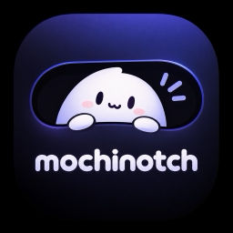
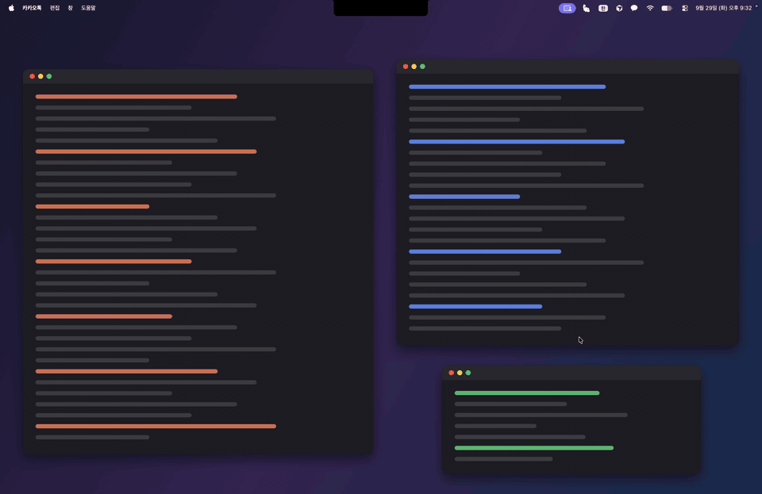
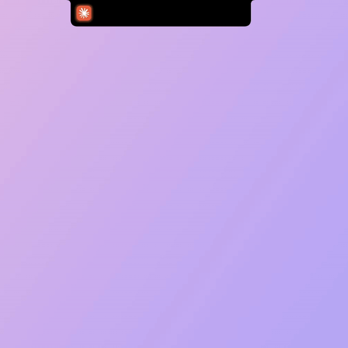
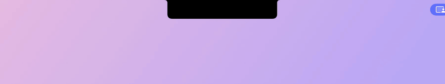
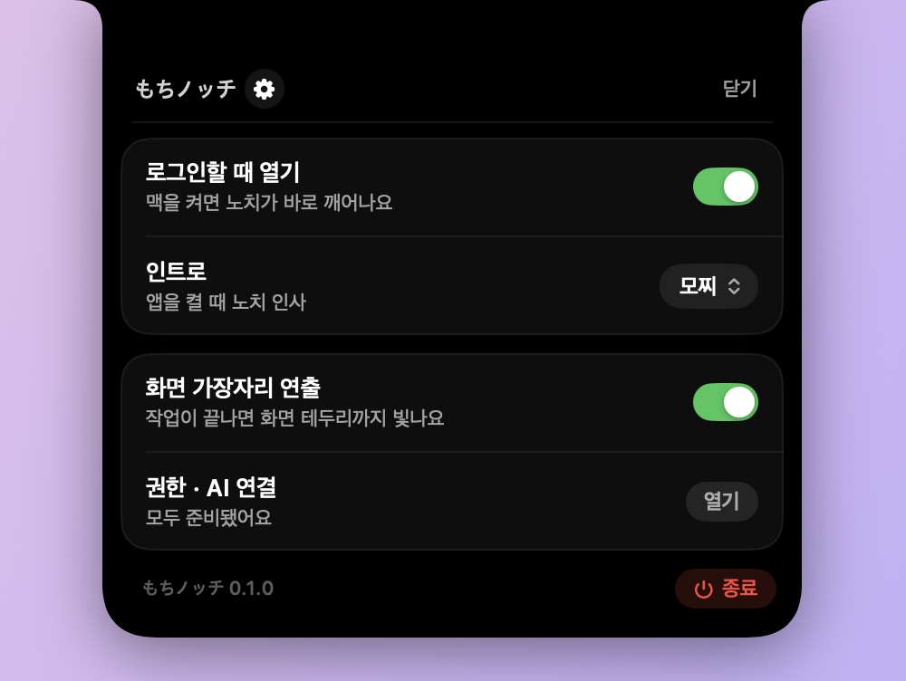
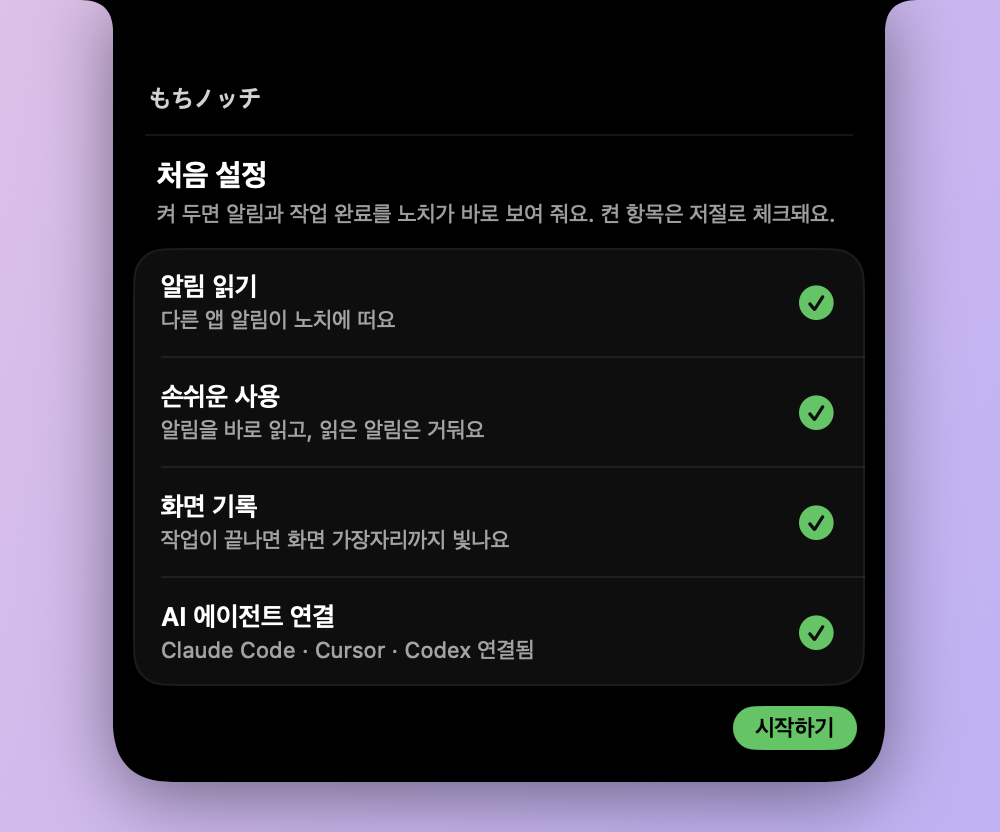

<p align="center">
  
</p>

<h3 align="center"><picture><source media="(prefers-color-scheme: dark)" srcset="docs/images/headings/title-dark.png"></picture></h3>

<p align="center">
  맥북 노치를 말랑한 다이나믹 아일랜드로.<br>
  충전, 알림, AI 에이전트 작업 완료를 노치에서 바로 봅니다.
</p>


---

<h3><picture><source media="(prefers-color-scheme: dark)" srcset="docs/images/headings/features-dark.png"></picture></h3>

### 알림이 노치 옆에 쌓여요

메시지, Slack, 카카오톡 같은 앱의 알림이 오면 노치 오른쪽에 앱 아이콘이 톡 튀어나오고, Dock처럼 개수 배지가 붙습니다. 다른 앱 알림이 오면 한 칸씩 더 늘어나요.

<p align="center">
  
</p>


### 충전기를 꽂으면

노치 양옆으로 번개와 배터리 퍼센트가 나왔다가 접힙니다.

<p align="center">
  
</p>


### AI 작업이 끝나면

Claude Code, Cursor, Codex가 작업을 마치면 노치가 옆으로 펼쳐지며 알려 줍니다. 테두리를 따라 빛이 한 바퀴 돌고, 화면 가장자리까지 그 앱 색으로 은은하게 빛나요.

<p align="center">
  
</p>

작업이 실패하면 노치가 짧게 흔들리고 붉은 테두리가 생깁니다.


### 마우스를 올리면 목록이 펼쳐져요

지금까지 온 알림, 작업 완료, 충전 기록이 최신순으로 쌓여 있습니다. 항목을 누르면 그 앱으로 바로 이동해요.

<p align="center">
  
</p>


### 인트로

앱을 켜면 노치가 말랑하게 늘어나며 인사합니다. 두 가지 중에 고를 수 있어요.

| 모찌 | 늘리기 |
|:---:|:---:|
|  |  |
| 왼쪽, 오른쪽을 톡톡 내밀었다가 한 번 눌린 뒤 벌어져요 | 떡처럼 양옆으로 쭉 늘어났다가 튕겨 들어와요 |

---

<h3><picture><source media="(prefers-color-scheme: dark)" srcset="docs/images/headings/settings-dark.png"></picture></h3>

톱니바퀴를 누르면 창이 따로 뜨지 않고 노치가 조금 더 커지며 설정이 나옵니다.

<p align="center">
  
</p>

- **로그인할 때 열기**: 맥을 켜면 자동으로 시작합니다.
- **인트로**: 켤 때 인사를 `모찌`, `늘리기` 중에서 고릅니다. 고른 뒤 노치에서 마우스를 치우면 바로 한 번 보여 줘요.
- **화면 가장자리 연출**: 끄면 AI 작업이 끝날 때 노치 테두리만 빛나고 화면은 그대로 둡니다.
- **권한 · AI 연결**: 처음 켰을 때 뜨는 **처음 설정** 화면을 다시 엽니다. 아직 꺼진 항목이 몇 개인지 보여 줘요.

---

<h3><picture><source media="(prefers-color-scheme: dark)" srcset="docs/images/headings/permissions-dark.png"></picture></h3>

처음 켜면 인사가 끝난 뒤 노치가 **처음 설정**을 펼칩니다. 시스템 설정을 오가는 동안 접히지 않고 기다려요.

<p align="center">
  
</p>

- 항목마다 **허용**을 누르면 macOS 안내 창이나 **시스템 설정 → 개인정보 보호 및 보안**의 해당 목록이 열립니다. 켠 항목은 저절로 초록 체크로 바뀌어요.
- **전체 디스크 접근 권한** 목록에 Mochinotch가 없으면 아래 **+**를 눌러 `응용 프로그램`의 `Mochinotch`를 추가하세요.
- **화면 기록**은 켠 뒤 앱을 다시 켜야 적용돼요. 처음 설정 아래의 **다시 켜기**를 누르면 됩니다.
- **AI 에이전트 연결**의 **연결**을 누르면 hook까지 한 번에 넣어요. 자세한 건 아래 AI 에이전트 연결을 보세요.
- **나중에**를 누르면 닫히고 다시 저절로 뜨지 않아요. 설정 → **권한 · AI 연결**에서 언제든 다시 열 수 있어요.

| 권한 | 어디에 쓰나요 | 없으면 |
|---|---|---|
| **전체 디스크 접근 권한** | 알림 센터 기록을 읽어 노치에 알림을 띄워요 | 다른 앱 알림이 노치에 안 떠요. 충전과 AI 작업 완료는 그대로 돼요 |
| **손쉬운 사용** | 알림 배너를 뜨자마자 읽고, 채팅방을 열거나 Dock 배지가 사라지면 읽음으로 처리해요 | 알림이 조금 늦게 뜨고, 읽은 알림이 노치에 더 오래 남아요 |
| **화면 기록** | 작업이 끝날 때 화면 가장자리 연출을 그려요 | 화면 가장자리 연출만 빠지고, 노치 테두리 빛은 그대로예요 |

> [!TIP]
> 화면을 녹화하거나 전송하지 않습니다. 화면 기록 권한은 연출하는 몇 초 동안 화면을 비춰 휘게 그리는 데에만 씁니다.

---

<h3><picture><source media="(prefers-color-scheme: dark)" srcset="docs/images/headings/faq-dark.png"></picture></h3>

<details>
<summary><b>다른 앱 알림이 노치에 안 떠요</b></summary>
<br>

**전체 디스크 접근 권한**에 Mochinotch가 켜져 있는지 확인하고, 앱을 종료했다가 다시 여세요. 앱이 켜진 뒤에 온 알림만 보입니다. 그 앱의 알림 자체가 **시스템 설정 → 알림**에서 꺼져 있으면 노치에도 오지 않아요.

</details>

<details>
<summary><b>AI 작업이 끝나도 아무 반응이 없어요</b></summary>
<br>

- Mochinotch가 켜져 있는지 확인하세요. 꺼져 있으면 신호는 조용히 버려집니다.
- 설정 → **권한 · AI 연결**에서 **AI 에이전트 연결**에 초록 체크가 있는지 확인하세요. 터미널에서 쓰는 Claude Code와 Codex는 연결한 뒤 새로 연 세션부터 적용돼요.
- 위 [직접 보내 보기](#직접-보내-보기)의 `curl`로 노치가 반응하는지 보면 앱과 hook 중 어디가 문제인지 알 수 있어요.
- hook 실행 기록은 `~/Library/Logs/Mochinotch/hooks.log`에 남습니다.

</details>

<details>
<summary><b>화면 가장자리 연출이 안 나와요</b></summary>
<br>

**화면 기록** 권한이 필요합니다. 설정 → **권한 · AI 연결**에서 **화면 기록**의 **허용**을 누르고, 시스템 설정에서 켠 뒤 **다시 켜기**를 누르세요. 화면 기록은 앱을 다시 켜야 적용돼요. 연출이 부담스럽다면 설정에서 **화면 가장자리 연출**을 끄세요.

</details>

<details>
<summary><b>노치가 없는 맥이나 외부 모니터에서도 되나요?</b></summary>
<br>

네. 노치 자리 대신 화면 위 가운데에 검은 알약 모양으로 뜹니다. 노치가 있는 화면이 연결되어 있으면 그 화면을 먼저 씁니다.

</details>

<details>
<summary><b>macOS를 업데이트했더니 알림이 안 와요</b></summary>
<br>

알림은 macOS 알림 센터의 비공개 데이터베이스를 읽어서 가져옵니다. 애플이 형식을 바꾸면 업데이트 후에 동작하지 않을 수 있어요. 새 버전이 나오면 [Releases](https://github.com/sleeeppy/mochinotch/releases)를 확인해 주세요.

</details>

<details>
<summary><b>개인정보는 어디로 가나요?</b></summary>
<br>

밖으로 나가지 않습니다. 인터넷에 연결하지 않고, 이벤트는 내 맥 안의 `127.0.0.1`로만 받습니다.

노치 목록은 메모리에만 있어서 앱을 끄면 사라집니다. 문제를 찾기 위한 기록이 `~/Library/Logs/Mochinotch/`에 남는데, 알림은 앱과 제목까지만 적고 본문은 적지 않습니다. 이 폴더는 언제 지워도 괜찮아요.

</details>

<details>
<summary><b>완전히 지우고 싶어요</b></summary>
<br>

1. 설정에서 **종료**를 누르고 `/Applications/Mochinotch.app`을 휴지통에 버립니다.
2. hook을 넣었다면 위 표의 설정 파일에서 `mochinotch-notify`가 들어간 줄을 지우거나, `.mochinotch.bak`으로 되돌립니다.
3. `~/.local/bin/mochinotch-notify`와 `~/Library/Logs/Mochinotch/` 폴더를 지웁니다.

</details>

---

<h3><picture><source media="(prefers-color-scheme: dark)" srcset="docs/images/headings/install-dark.png"></picture></h3>

**필요한 것:** macOS 14 Sonoma 이상. 노치가 있는 맥북에서 가장 잘 어울리고, 노치가 없는 맥이나 외부 모니터에서는 화면 위 가운데에 작은 알약 모양으로 뜹니다.

1. [Releases](https://github.com/sleeeppy/mochinotch/releases/latest) 페이지에서 최신 `Mochinotch.zip`을 받습니다.
2. 압축을 풀고 `Mochinotch.app`을 **응용 프로그램** 폴더로 옮깁니다.
3. 앱을 엽니다.

> [!NOTE]
> 애플 공증을 받지 않은 앱이라 처음 열 때 "확인되지 않은 개발자" 경고가 뜰 수 있어요.
>
> - **시스템 설정 → 개인정보 보호 및 보안**으로 가서 맨 아래 `Mochinotch`의 **그래도 열기**를 누르세요.
> - 또는 터미널에서 한 번만 실행하면 됩니다.
>
>   ```bash
>   xattr -dr com.apple.quarantine /Applications/Mochinotch.app
>   ```

앱이 켜지면 노치가 한 번 인사하고, 이어서 **처음 설정**을 펼칩니다. 위 권한 설정을 보세요. Dock이나 메뉴 막대에는 아이콘이 생기지 않아요. 모든 조작은 노치에서 합니다.

---

<h3><picture><source media="(prefers-color-scheme: dark)" srcset="docs/images/headings/usage-dark.png"></picture></h3>

| 하고 싶은 것 | 방법 |
|---|---|
| 기록 보기 | 노치에 마우스를 올려요 |
| 그 앱으로 가기 | 펼친 목록에서 항목을 눌러요 |
| 기록 비우기 | 펼친 목록 오른쪽 위 **지우기** |
| 설정 열기 | 펼친 목록 왼쪽 위 톱니바퀴 ⚙︎ |
| 앱 끄기 | 설정 맨 아래 **종료** |

- 오른쪽 알림 아이콘은 목록을 한 번 펼쳐 보면 노치 안으로 들어갑니다.
- 왼쪽 AI 작업 아이콘은 그 앱(Claude, Cursor, Codex)을 앞으로 가져오면 사라집니다.
- 목록은 앱을 켜 둔 동안만 쌓이고, 최근 30개까지 남습니다.

---

<h3><picture><source media="(prefers-color-scheme: dark)" srcset="docs/images/headings/agents-dark.png"></picture></h3>

AI 도구가 작업을 끝냈다는 신호를 노치로 보내려면 각 도구에 hook을 한 번 넣어야 합니다. AI API를 호출하거나 대화 내용을 보내지 않습니다. 내 맥 안(`127.0.0.1:47321`)으로 "끝났다"는 신호만 갑니다.

### 버튼 하나로 연결

처음 설정이나 설정 → **권한 · AI 연결**에서 **AI 에이전트 연결**의 **연결**을 누르세요. 터미널도, python 같은 추가 설치도 필요 없어요.

1. 이 맥에서 찾은 도구의 설정 파일에만 hook을 넣습니다. 고치기 전에 원래 파일을 `.mochinotch.bak`으로 복사하고, 이미 연결된 파일은 건드리지 않아요.
2. 켜져 있는 Cursor, Claude, Codex 앱은 저절로 다시 켜서 바로 적용합니다. 저장하지 않은 작업이 있어 앱이 종료를 물어보면 억지로 끄지 않고, 직접 다시 켜 달라고 알려 줘요.
3. 터미널에서 쓰는 Claude Code와 Codex는 새로 여는 세션부터 적용돼요.

| 도구 | 파일 | 알려 주는 것 |
|---|---|---|
| Claude Code | `~/.claude/settings.json` | 작업 완료, 실패, 확인 필요 |
| Cursor | `~/.cursor/hooks.json` | 작업 완료, 실패, 중단 |
| Codex | `~/.codex/config.toml` | 작업 완료 (원래 있던 `notify`도 그대로 실행돼요) |

hook은 `~/.local/bin/mochinotch-notify`를 부르고, 이 파일이 앱을 불러 신호를 보냅니다. 앱을 옮기거나 업데이트해도 다음에 켤 때 이 파일만 새 위치로 고쳐서 연결이 끊기지 않아요.

터미널에서 연결하려면 이렇게 실행합니다. 이미 켜져 있는 도구는 직접 다시 켜 주세요.

```bash
/Applications/Mochinotch.app/Contents/MacOS/Mochinotch --install-hooks
```

### 직접 보내 보기

앱이 켜져 있을 때 터미널에서 보내면 노치에 바로 뜹니다. 내 스크립트나 다른 도구에서도 이렇게 쓸 수 있어요.

```bash
curl -s -X POST http://127.0.0.1:47321/event \
  -H 'Content-Type: application/json' \
  -d '{"tool":"claude","detail":"README 정리 끝","kind":"completed"}'
```

| 필드 | 값 |
|---|---|
| `tool` | `claude`, `cursor`, `codex`, 그 밖의 값은 일반 작업 |
| `kind` | `completed`, `failed`, `needsInput`, `cancelled` |
| `title`, `detail` | 목록에 보일 제목과 설명 (생략 가능) |
| `bundleID` | 항목을 눌렀을 때 열 앱 (예: `com.apple.Terminal`) |

URL로도 보낼 수 있습니다.

```text
mochinotch://event?tool=cursor&kind=completed&detail=빌드%20끝
```

---

<h3><picture><source media="(prefers-color-scheme: dark)" srcset="docs/images/headings/build-dark.png"></picture></h3>

Xcode 15 이상이 필요합니다.

```bash
brew install xcodegen
xcodegen generate
open Mochinotch.xcodeproj
```

Xcode에서 서명을 **Sign to Run Locally**로 두고 Run 합니다. 터미널에서는 `./scripts/run-dev.sh` 하나로 빌드하고, 떠 있던 앱을 끈 뒤 새로 띄웁니다. 개발 빌드는 다시 빌드할 때마다 서명이 바뀌어서 권한을 다시 켜야 할 수 있어요.

| 경로 | 역할 |
|---|---|
| `Mochinotch/` | 앱 소스 |
| `Mochinotch/Hooks/` | hook 전달(`--hook`)과 설정 병합(`--install-hooks`) |
| `scripts/install-hooks.sh` | 빌드한 앱으로 `--install-hooks` 실행 |
| `hooks/` | 도구별 설정 예시 |
| `docs/` | 개발 플랜과 README 이미지 |
