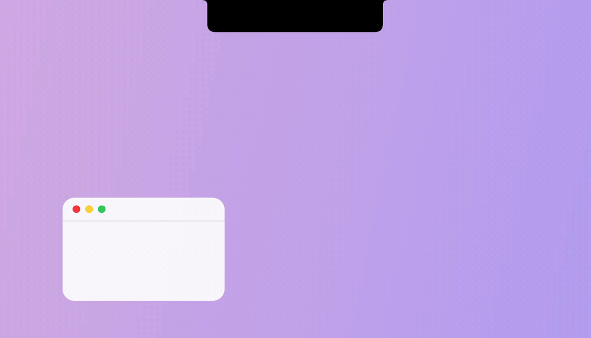
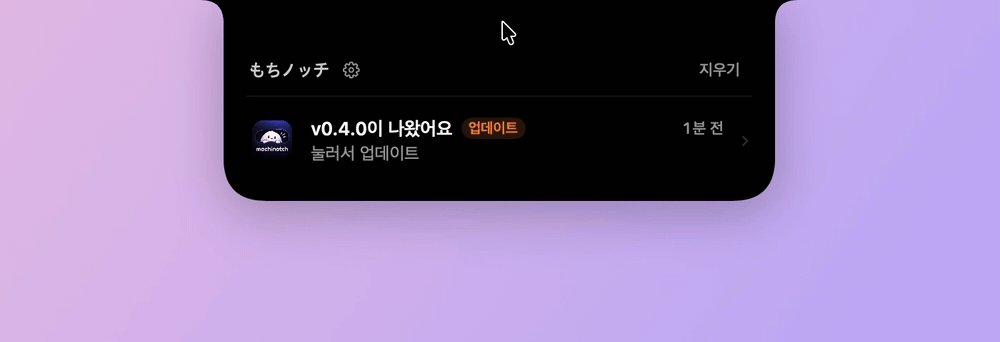

<p align="center">
  <a href="../README.md">한국어</a> · <a href="README.en.md">English</a> · <b>日本語</b> · <a href="README.zh.md">中文</a>
</p>

<p align="center">
  
</p>

<h3 align="center">もちノッチ</h3>

<p align="center">
  MacBook のノッチを、やわらかいダイナミックアイランドに。<br>
  充電、通知、AI エージェントの作業完了をノッチでそのまま見ます。
</p>

---

### 通知がノッチの横にたまります

メッセージ、Slack、カカオトークなどの通知が来ると、ノッチの右にアプリアイコンが飛び出して、Dock のようにバッジが付きます。
別のアプリの通知が来ると、一枠ずつ増えます。

<p align="center">
  
</p>
<br/>

### 充電器を挿すと

ノッチの両脇に稲妻とバッテリー残量が出て、それから折りたたまれます。

<p align="center">
  
</p>
<br/>

### AI の作業が終わると

AI エージェント（Claude Code、Cursor、Codex、Kiro）が作業を終えると、ノッチが横に広がって知らせます。<br/>
縁に沿って光が一周し、画面の縁までそのアプリの色でやわらかく光ります。

<p align="center">
  
</p>

<br/>

### エージェントが返事を待っているとき

Claude や Codex が承認や質問を出すと、ノッチにオレンジの**確認**が開きます。答えるまで開いたままで、画面の縁は光りません。

<p align="center">
  
</p>

<br/>

### マウスを乗せると一覧が開きます

届いた通知、作業完了、充電の記録が新しい順にたまります。項目を押すとそのアプリに移ります。

<p align="center">
  
</p>

<br/>

### ファイルをしばらくノッチに預けます

ファイルをドラッグして近づけると、ノッチが下がって置く場所を作ります。右の**預ける**に置くと、写真の下がノッチの下から少し顔を出します。左右は設定で入れ替えられます。<br/>

<p align="center">
  
</p>

<br/>

### ファイルをノッチに置くと AirDrop

左の **AirDrop** に置くとノッチが折りたたまれ、AirDrop のウィンドウが開いて送り先を選べます。

<p align="center">
  
</p>

</br>

### アプリの中でアップデート

新しいバージョンがあると、この一覧に**新しいアップデート**が付きます。その行を押すと、その場で受け取って入れ替えて再起動します。**v0.3.5 以降**はアプリの中でアップデートできます。

<p align="center">
  
</p>

<br/>

---

### 設定

歯車を押しても別のウィンドウは出ません。ノッチが少し大きくなって、中に設定が出ます。

<p align="center">
  
</p>

- **ログイン時に開く**: Mac を起動すると自動で始まります。
- **イントロ**: 起動時のあいさつを `もち` と `のばす` から選びます。選んだあとノッチからマウスを外すと、一度再生されます。
- **画面の縁の演出**: オフにすると、AI の作業が終わったときノッチの縁だけが光り、画面はそのままです。
- **権限 · AI 接続**: 最初に出る権限設定を再び開きます。まだオフの項目がいくつあるか分かります。
- **使い方**: 一番下のバージョンの隣にあります。押すとこのページが開きます。
- **預けるを左に**: オンにすると預けるが左、AirDrop が右です。オフはその逆です。
- **言語**: 한국어、日本語、English、中文 から選びます。ノッチの言葉はすぐに変わります。

---

### 権限

最初の起動では、あいさつのあとノッチが**初期の権限設定**を開きます。システム設定を行き来しているあいだ、閉じずに待っています。

<p align="center">
  
</p>

- 各項目の**許可**を押すと、macOS の案内か **システム設定 → プライバシーとセキュリティ** の該当リストが開きます。オンにした項目は自動で緑のチェックになります。
- **フルディスクアクセス**の一覧に Mochinotch がなければ、下の + から `アプリケーション` の `Mochinotch` を追加します。
- **画面収録**は、アプリを再起動してから適用されます。権限設定の下の**再起動**を押します。
- **AI エージェント接続**の**接続**を押すと、hook まで一度に入ります。詳しくは下の AI エージェント接続を見てください。
- **あとで**を押すと閉じて、自動では再表示されません。設定 → **権限 · AI 接続** からいつでも開けます。

<br/>

| 権限 | 用途 | ないと |
|---|---|---|
| **フルディスクアクセス** | 通知センターの記録を読んで、ノッチに通知を出します | ほかのアプリの通知は出ません。充電と AI の作業完了はそのままです |
| **アクセシビリティ** | 通知バナーが出た瞬間に読み、チャットを開くか Dock のバッジが消えたら既読にします | 通知が少し遅くなり、既読の通知がノッチに長く残ります |
| **画面収録** | 作業が終わったとき、画面の縁の演出を描きます | その演出だけが抜け、ノッチの縁の光はそのままです |

<br/>

> [!TIP]
> 画面の録画や送信はしません。画面収録の権限は、演出の数秒間、画面を照らして光を描くためだけに使います。

---

### よくある質問

<details>
<summary><b>ほかのアプリの通知がノッチに出ない</b></summary>
<br>

**フルディスクアクセス**で Mochinotch がオンか確認し、アプリを終了して開き直してください。アプリが起動したあとに来た通知だけが見えます。そのアプリの通知自体が **システム設定 → 通知** でオフなら、ノッチにも来ません。

</details>

<details>
<summary><b>AI の作業が終わっても反応がない</b></summary>
<br>

- Mochinotch が起動しているか確認してください。終了していると、信号は静かに捨てられます。
- 設定 → **権限 · AI 接続** で、**AI エージェント接続**に緑のチェックがあるか確認してください。ターミナルの Claude Code と Codex は、接続したあとの新しいセッションから適用されます。
- 下の [自分で送ってみる](#自分で送ってみる) の `curl` で、アプリと hook のどちらが問題か分かります。
- hook の実行記録は `~/Library/Logs/Mochinotch/hooks.log` に残ります。

</details>

<details>
<summary><b>画面の縁の演出が出ない</b></summary>
<br>

**画面収録**の権限が必要です。設定 → **権限 · AI 接続** で **画面収録** の **許可** を押し、システム設定でオンにしてから **再起動** を押してください。画面収録は再起動しないと適用されません。演出が重いときは、設定で **画面の縁の演出** をオフにします。

</details>

<details>
<summary><b>ノッチのない Mac や外部ディスプレイでも使えますか？</b></summary>
<br>

はい。ノッチの代わりに、画面上部の中央に黒いカプセルとして出ます。ノッチのある画面が接続されていれば、その画面を優先します。

</details>

<details>
<summary><b>macOS をアップデートしたら通知が来なくなった</b></summary>
<br>

通知は macOS 通知センターの非公開データベースを読んで取得します。Apple が形式を変えると、アップデート後に動かなくなることがあります。新しいバージョンが出たら [Releases](https://github.com/sleeeppy/mochinotch/releases) を確認してください。

</details>

<details>
<summary><b>個人情報はどこへ行きますか？</b></summary>
<br>

外には出ません。インターネットには接続せず、イベントはこの Mac の `127.0.0.1` だけで受け取ります。

ノッチの一覧はメモリだけなので、アプリを終了すると消えます。調査用の記録が `~/Library/Logs/Mochinotch/` に残りますが、通知はアプリとタイトルまでで、本文は書きません。このフォルダはいつ消しても大丈夫です。

</details>

<details>
<summary><b>完全に消したい</b></summary>
<br>

1. 設定で **終了** を押し、`/Applications/Mochinotch.app` をゴミ箱に入れます。
2. hook を入れていたら、下の表の設定ファイルから `mochinotch-notify` を含む行を消すか、`.mochinotch.bak` に戻します。
3. `~/.local/bin/mochinotch-notify`、`~/.kiro/hooks/mochinotch.json`、`~/Library/Logs/Mochinotch/` を消します。

</details>

---

### インストール

**必要環境:** macOS 14 Sonoma 以降

ノッチのある MacBook にいちばん合います。ノッチのない Mac や外部ディスプレイでは、画面上部の中央に小さなカプセルとして出ます。
<br/>
1. [Releases](https://github.com/sleeeppy/mochinotch/releases/latest) から最新の `Mochinotch.dmg` を受け取ります。
2. 開いたら、`Mochinotch.app` を **Applications** フォルダにドラッグします。
3. アプリを開きます。

新しいバージョンが出るとノッチが知らせ、設定の一番下に **アップデート** が出ます。**v0.3.5 以降**なら、押すとその場で受け取って入れ替えて再起動します。オンにした権限と AI 接続はそのままです。v0.3.4 以前はここから一度インストールすると、その次からはアプリの中でアップデートされます。

<br/>

> [!NOTE]
> Apple の公証を受けていないため、最初に開くとき「未確認の開発元」と出ることがあります。
>
> - **システム設定 → プライバシーとセキュリティ** を開き、一番下の `Mochinotch` の **このまま開く** を押します。
> - またはターミナルで一度だけ実行します。
>
>   ```bash
>   xattr -dr com.apple.quarantine /Applications/Mochinotch.app
>   ```

<br/>

アプリが起動するとノッチが一度あいさつし、続いて **初期の権限設定** を開きます。<br/>
Dock やメニューバーにはアイコンは出ません。操作はすべてノッチでします。

---

### 使い方

| したいこと | 方法 |
|---|---|
| 記録を見る | ノッチにマウスを乗せる |
| そのアプリへ行く | 開いた一覧の項目を押す |
| 記録を消す | 一覧右上の **消去** |
| 設定を開く | 一覧左上の歯車 |
| アプリを終了する | 設定一番下の **終了** |

- 右の通知アイコンは、一覧を一度開くとノッチの中に戻ります。
- 左の AI 作業アイコンは、そのアプリ（Claude、Cursor、Codex、Kiro）を前面にすると消えます。
- 一覧はアプリを起動しているあいだだけたまり、最新 30 件まで残ります。

---

### AI エージェント接続（Claude Code · Cursor · Codex · Kiro）

作業が終わったという信号をノッチへ送るには、各ツールに hook を一度入れる必要があります。AI の API は呼ばず、会話の内容も送りません。この Mac の中（`127.0.0.1:47321`）へ「終わった」という信号だけが行きます。

### ボタンひとつで接続

初期の権限設定、または設定 → **権限 · AI 接続** で、**AI エージェント接続** の **接続** を押します。ターミナルも、Python のような追加インストールも要りません。

1. この Mac で見つかったツールの設定ファイルにだけ hook を入れます。直す前に元のファイルを `.mochinotch.bak` にコピーし、すでに接続済みのファイルは触りません。
2. 開いている Cursor、Claude、Codex は自動で再起動して、すぐに適用します。保存していない作業があって終了を確認されたら、無理に終了せず、自分で再起動するよう知らせます。Kiro は hook フォルダを自分で読み直すので、再起動しません。
3. ターミナルの Claude Code と Codex は、新しく開くセッションから適用されます。

| ツール | ファイル | 知らせること |
|---|---|---|
| Claude Code | `~/.claude/settings.json` | 作業完了、失敗、承認、質問カード |
| Cursor | `~/.cursor/hooks.json` | 作業完了、失敗、中断。質問カードは Cursor の通知で受けます |
| Codex | `~/.codex/config.toml`、`~/.codex/hooks.json` | 作業完了、承認（もともとあった `notify` もそのまま実行されます） |
| Kiro | `~/.kiro/hooks/mochinotch.json` | 作業完了。入力待ち画面用の hook は、Kiro がまだ送りません |

hook は `~/.local/bin/mochinotch-notify` を呼び、このファイルがアプリを呼んで信号を送ります。アプリを移動したりアップデートしても、次の起動でこのファイルだけ新しい場所に直すので、接続は切れません。

ターミナルから接続するには、こう実行します。すでに開いているツールは自分で再起動してください。

```bash
/Applications/Mochinotch.app/Contents/MacOS/Mochinotch --install-hooks
```

### 自分で送ってみる

アプリが起動しているとき、ターミナルから送るとノッチにすぐ出ます。自分のスクリプトや別のツールからも同じように使えます。

```bash
curl -s -X POST http://127.0.0.1:47321/event \
  -H 'Content-Type: application/json' \
  -d '{"tool":"claude","detail":"README を整理した","kind":"completed"}'
```

| フィールド | 値 |
|---|---|
| `tool` | `claude`、`cursor`、`codex`。それ以外は一般の作業 |
| `kind` | `completed`、`failed`、`needsInput`、`cancelled` |
| `title`、`detail` | 一覧に出すタイトルと説明（省略可） |
| `bundleID` | 項目を押したときに開くアプリ（例: `com.apple.Terminal`） |

URL でも送れます。

```text
mochinotch://event?tool=cursor&kind=completed&detail=build%20done
```

---

### 自分でビルドする

Xcode 15 以降が必要です。

```bash
brew install xcodegen
xcodegen generate
open Mochinotch.xcodeproj
```

Xcode では署名を **Sign to Run Locally** にして Run します。ターミナルでは `./scripts/run-dev.sh` ひとつでビルドし、起動中のアプリを終了してから新しく起動します。開発ビルドはビルドのたびに署名が変わるので、権限を入れ直すことがあります。

| パス | 役割 |
|---|---|
| `Mochinotch/` | アプリのソース |
| `Mochinotch/Hooks/` | hook の転送（`--hook`）と設定のマージ（`--install-hooks`） |
| `scripts/install-hooks.sh` | ビルドしたアプリで `--install-hooks` を実行 |
| `hooks/` | ツールごとの設定例 |
| `docs/` | 開発プランと README の画像 |
